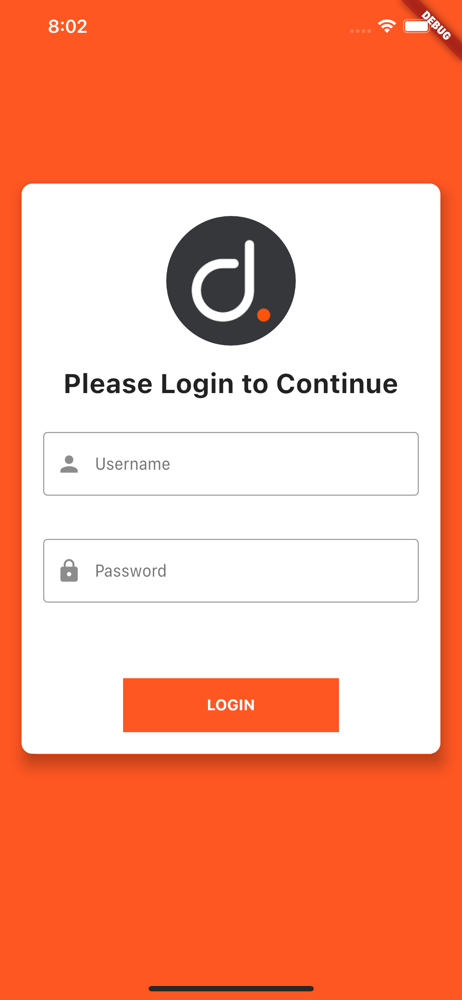
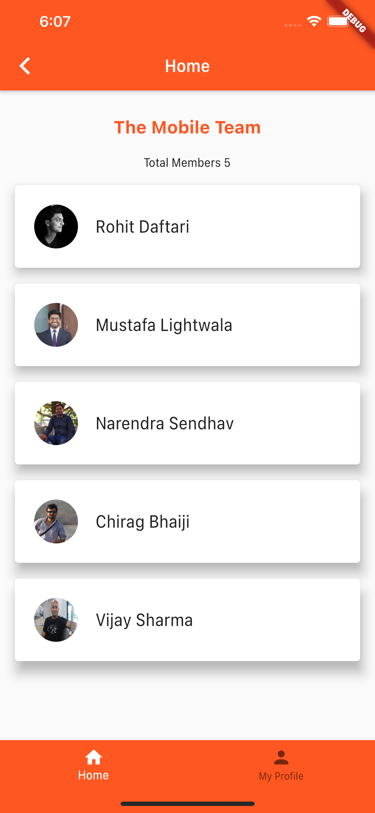

# Login , UsersList & Profile

## Problem -
- Create an app with multiple screens.
   - Login Password screen (with device end validations - email and password)
   - Home screen(Navigate from Login screen) 
   - Show two buttons (Button should look same in android and ios)   
      - List
      - Profile screen 
           - Show user image at top (Follow udemy to show image)
           - Email below the profile image see image below

## Solution - 

- username = admin , password = admin

   

   
