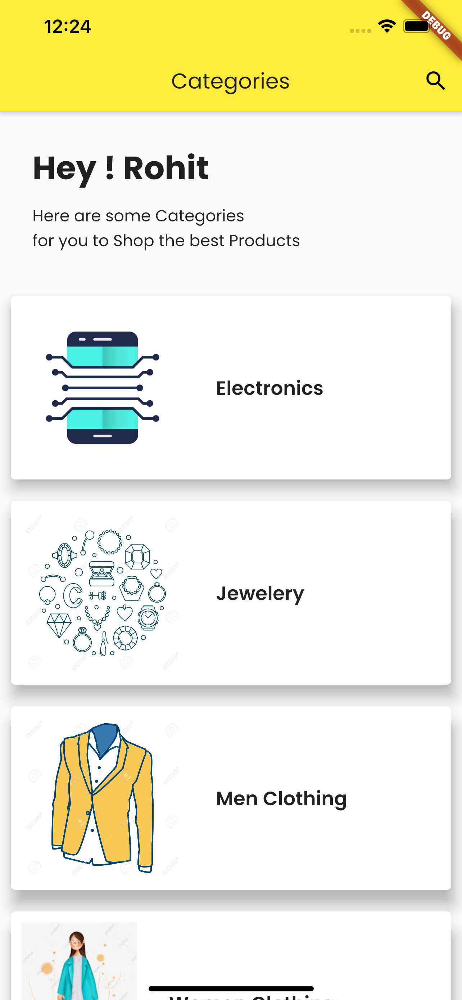
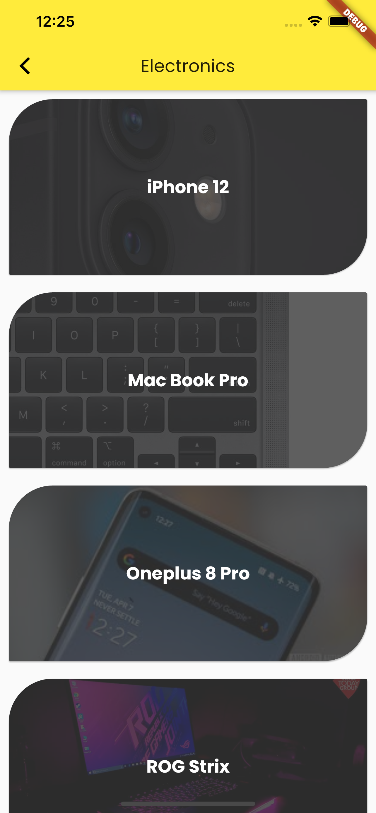
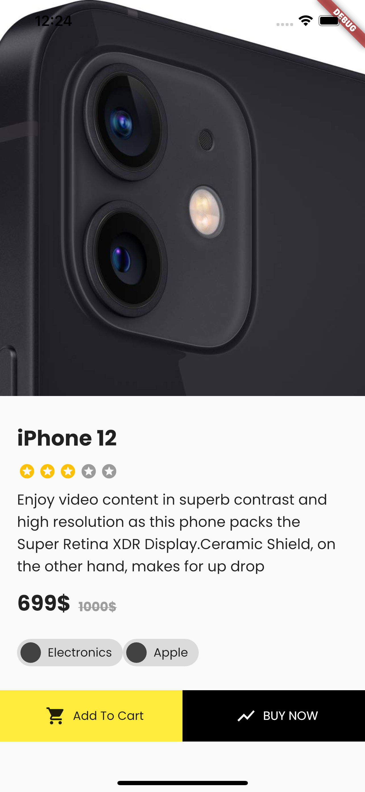
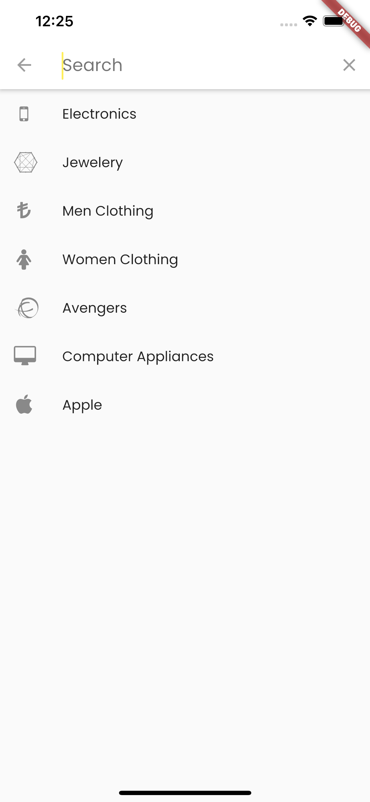
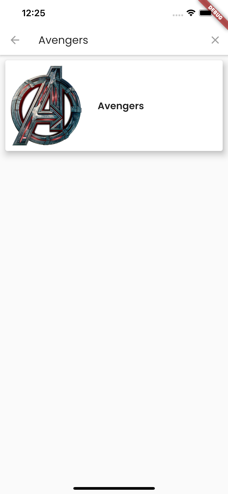

# shopping_app

Sample Shopping App 

## Problem -
- Create an app showing multiple categories of products.
- Select a category and jump to the next screen and show the list of products, users can search by typing name on both screens.
- On the product list there will be an image and below show basic details of product. If the user clicks on the image in the next screen the user can see full details of the product.

## Notes

- Implement using provider state management. 
- Be creative while designing the screen

## Solution - 

   

